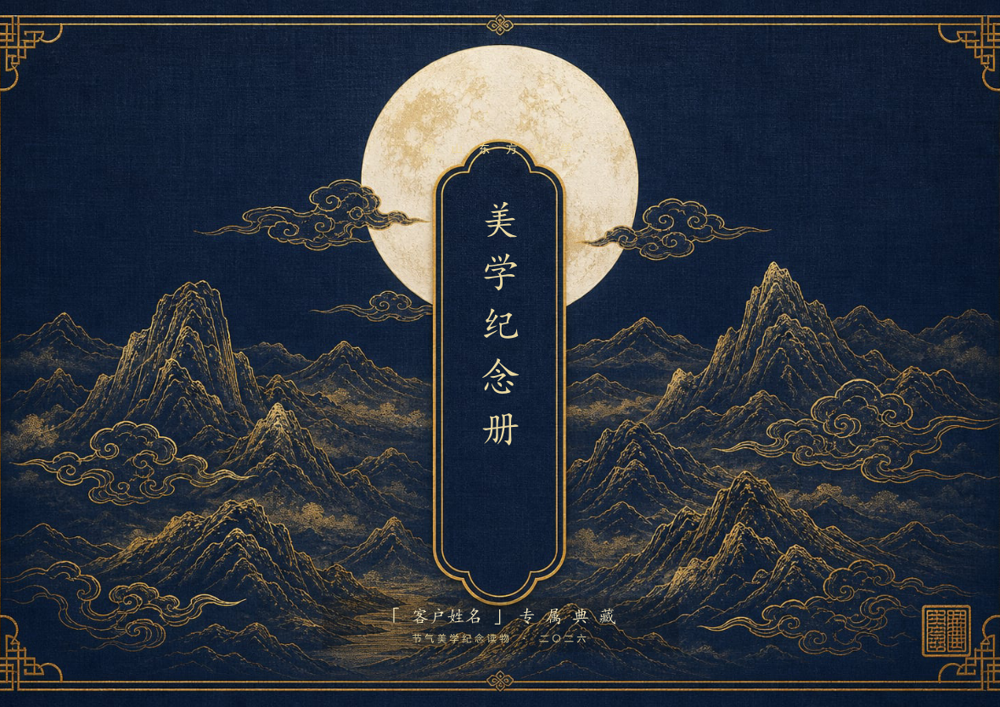
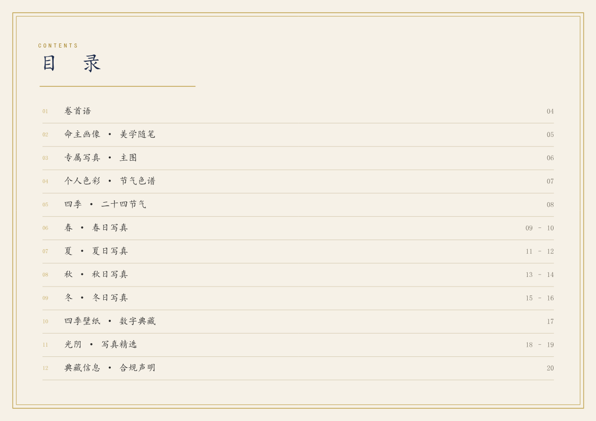
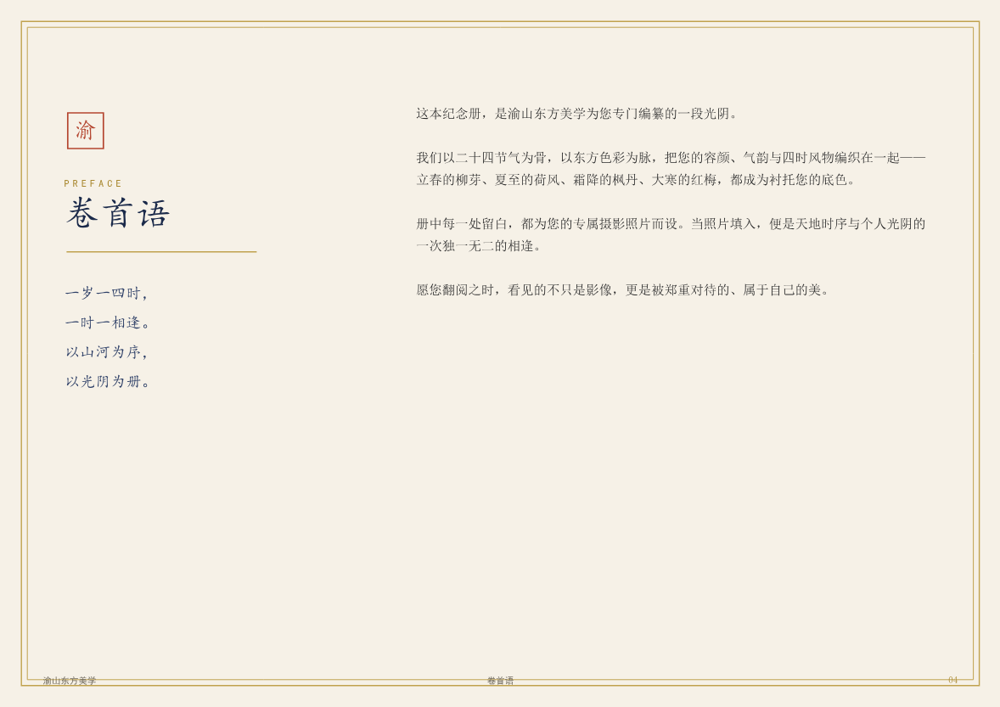
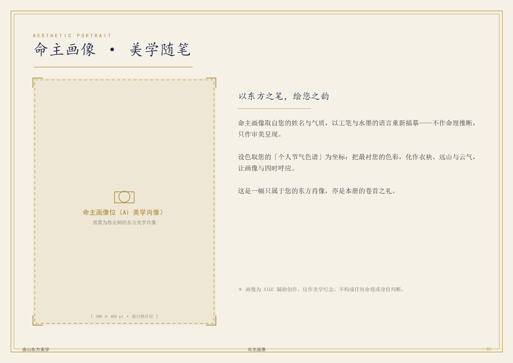
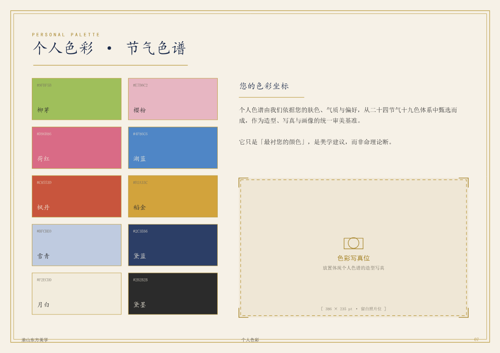
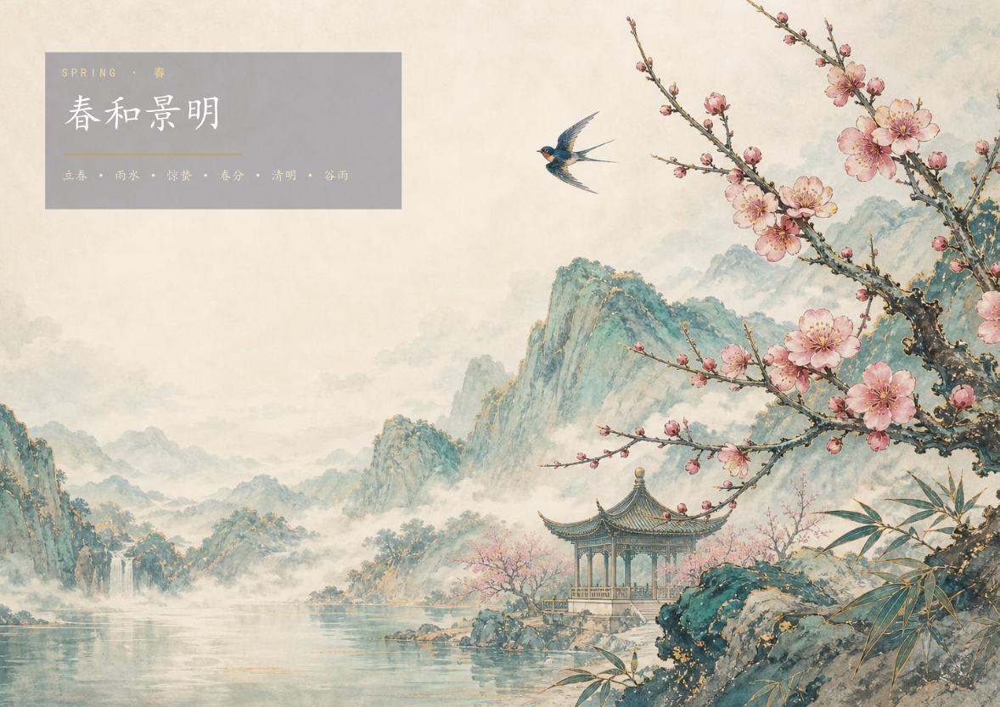
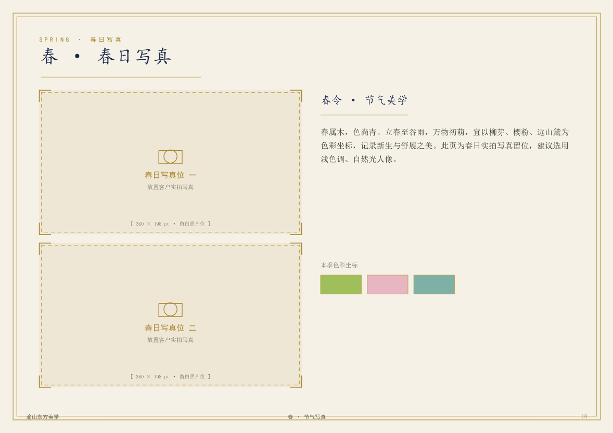
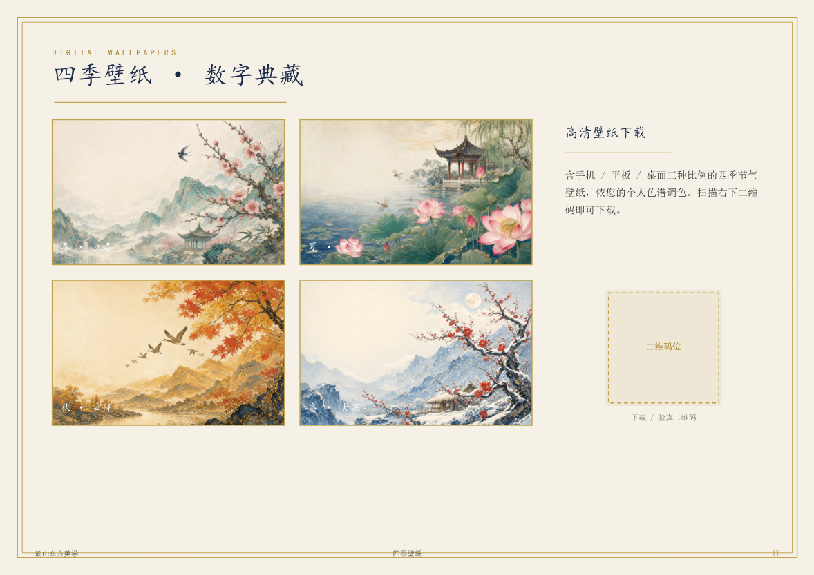
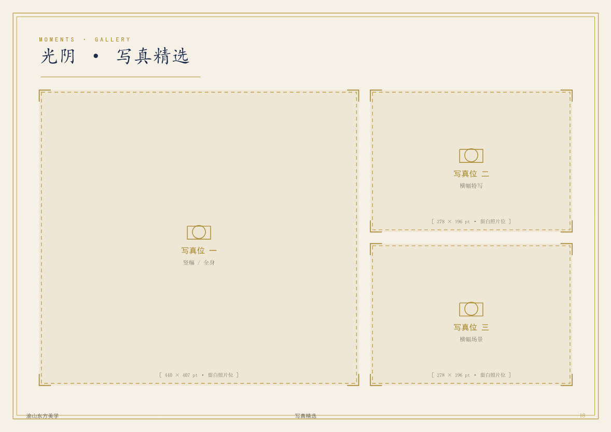
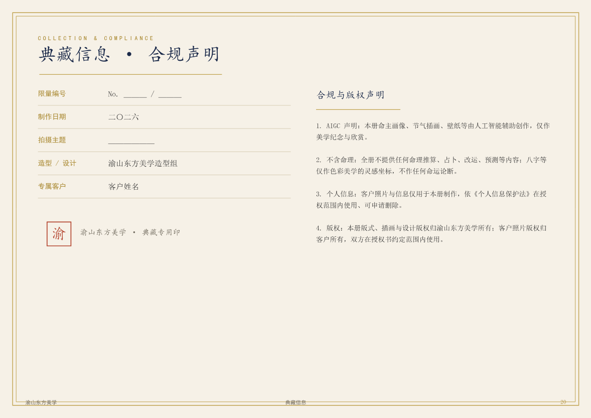

# 美学纪念册 · 交付内容定义（客服 / 印厂统一口径）

> 适用 SKU：高定订阅数字版（含于年度套餐）、`SKU-203` 美学纪念册·精装本（¥699）、`SKU-302` 实拍写真+命主画像+美学纪念册套装。
>
> 本页是**客服话术、印厂下单、内容排版**三方共用的口径基准。任何对外文案与成品，不得超出本页"包含/不包含"范围。
>
> **版式定稿**：下方「版式示意（终版）」为已确认的设计基准，印厂与排版以此为准。

---

## 〇、终版母版（已排版 · 可直接套用）

> **交付母版**：[`meixue-jiniance-template.pdf`](meixue-jiniance-template.pdf) —— A4 横版 21 页，深蓝麻布 + 烫金封面、月白艺术纸内文、统一金线细框与大留白。全册已排好版，所有客户照片处均为**金线照片占位框**，填入照片即成专属成品。
>
> **风格示意（场景图）**：见 [`jiniance-mockup/`](jiniance-mockup/)（早期场景示意，仅供风格参考；以本节母版为准）。

### 0.1 全本结构（21 页 · 与目录页码一致）

| 页 | 内容 | 照片位 | 说明 |
|---|---|---|---|
| 01 | 封面 | — | 满版水墨 + 竖排「美学纪念册」+「客户姓名 专属典藏」 |
| 02 | 扉页 / 版权 | — | 限量编号 + AIGC 声明（不含命理） |
| 03 | 目录 | — | 12 章索引，页码与正文一致 |
| 04 | 卷首语 | — | 美学叙事短文（不含运势） |
| 05 | 命主画像 · 美学随笔 | `portrait-main` | 竖向画像位 + 右栏随笔 |
| 06 | 专属写真 · 主图 | `zhenzhao-main` | 大横幅主图位 |
| 07 | 个人色彩 · 节气色谱 | `palette-photo` | 10 色卡（19 色体系）+ 色彩写真位 |
| 08 | 四时 · 二十四节气（章扉） | — | 深蓝章扉 + 四季缩略 |
| 09–10 | 春 · 春日写真 | `spring-1` `spring-2` | 满版春景 + 2 写真位 + 节气美学图文 |
| 11–12 | 夏 · 夏日写真 | `summer-1` `summer-2` | 满版夏景 + 2 写真位 + 图文 |
| 13–14 | 秋 · 秋日写真 | `autumn-1` `autumn-2` | 满版秋景 + 2 写真位 + 图文 |
| 15–16 | 冬 · 冬日写真 | `winter-1` `winter-2` | 满版冬景 + 2 写真位 + 图文 |
| 17 | 四季壁纸 · 数字典藏 | — | 四季壁纸缩略 + 下载/验真二维码位 |
| 18 | 光阴 · 写真精选 | `gallery-1/2/3` | 大图 + 两小图拼版 |
| 19 | 光阴 · 写真精选 II | `gallery-4/5` | 双竖幅拼版 |
| 20 | 典藏信息 · 合规声明 | — | 限量编号表 + AIGC/不含命理/PIPL/版权声明 |
| 21 | 封底 | — | 印章 + slogan + 合规小字 |

> 共 **16 个照片位**（`portrait-main / zhenzhao-main / palette-photo / spring-1,2 / summer-1,2 / autumn-1,2 / winter-1,2 / gallery-1~5`），全部为客户专属摄影照片预留。

### 0.2 版式预览（母版实拍 · 占位状态）

**封面**

**目录**

**卷首语**

**命主画像页（含金线照片位）**

**个人色彩 · 节气色谱页**

**春 · 满版节气美术页**

**春 · 春日写真内容页（2 照片位 + 图文 + 色条）**

**四季壁纸 · 数字典藏页（含二维码位）**

**光阴 · 写真精选拼版页**

**典藏信息 · 合规声明页**

> 版式要点：① 满版四季水墨页（春/夏/秋/冬）按节气分章；② 内文统一金线细框 + 大留白 + 楷体；③ 每个照片位带角标、镜框记号、占位说明与尺寸提示；④ 每页页脚含品牌名 / 章节名 / 页码 + 起止印章；⑤ 壁纸页附下载/验真二维码位；⑥ 正文为美学随笔（**严禁命理推算**）。

### 0.3 一键生成客户专属册（生成器）

母版由 Node 脚本 [`generate-jiniance.js`](generate-jiniance.js) 生成（依赖 `pdfkit`、四张四季 + 封面美术 `jiniance-art/`）。

- **空白母版**（全部显示照片占位框）：直接运行 `node generate-jiniance.js` → 输出 `meixue-jiniance-template.pdf`。
- **客户专属册**：复制 [`jiniance.config.example.json`](jiniance.config.example.json) 为 `jiniance.config.json`，填写：
  - `name` 姓名、`year` 年份、`edition`/`total` 限量编号、`subject` 主题、`designer` 造型；
  - `photos` 中按上表 16 个照片位 id 填入本地图片路径（任一留空则该位仍显示占位框）。
  - 运行 `node generate-jiniance.js` → 自动输出 `jiniance-<姓名>.pdf`，照片按位裁切适配，落框即成独一无二的专属纪念册。

> 照片位嵌图采用「等比裁切铺满（cover）」，无需预裁；建议来图分辨率 ≥ 框尺寸 2 倍（300dpi 印刷）。

---

## 一、一句话定位

「美学纪念册」是一本**以东方美学为线索、为客户个人定制的纪念读物**——把客户的命主画像、节气壁纸与节气/五行美学图文，汇编成一本可留存、可馈赠的精装（或数字）作品集。**它是美学纪念品，不是命理文书。**

---

## 二、包含什么（交付内容结构）

| 模块 | 内容 | 说明 |
|---|---|---|
| 封面 / 扉页 | 客户姓名 + 主题（如"四季·本命色"）+ 主理人 logo | 个性化定制页 |
| 命主画像页 | 1–3 张客户专属命主画像（实拍精修 / AI 无人脸背景合成） | 沿用实拍铁律 |
| 节气美学图文 | 二十四节气 / 五行主题的色彩、纹样、意象图文解读 | **美学叙事**，非运势 |
| 本命色卡页 | 客户专属用色组合（取自 19 色体系）+ 配色灵感 | 与壁纸/画像同源 |
| 节气壁纸合辑 | 客户套餐内壁纸的印刷版排布 | 数字版附下载二维码 |
| 美学随笔 | 围绕季节、色彩、传统纹样的轻文化短文 | 文化顾问把关准确性 |
| 收藏信息页 | 限量编号 / 制作日期 / 授权与脱敏说明 / AIGC 声明 | 末页固定 |

> 个性化来源：**客户姓名 + 所选主题 + 其专属视觉作品**。生辰仅用于决定**色彩坐标（美学用色）**，不展开任何命理推算文字。

---

## 三、不包含什么（红线）

- ❌ **不含八字 / 命理推算文字**：不写命格、运势、流年、吉凶、宜忌、姻缘、财运等断语。
- ❌ **不含算命 / 改运 / 转运 / 招财 / 辟邪 / 消灾**等任何功效或玄学宣称。
- ❌ **不含医疗 / 养生 / 疗效**类表述。
- ❌ 不替代任何专业命理、心理、医疗服务，不作预测性承诺。

> 客服遇到客户要求"加一段我的命理分析 / 运势"时，标准回复：
> "我们做的是**东方美学创作与纪念**，不算命、不预测。生辰只用作您专属配色的灵感坐标。如果您想了解命理，建议您咨询专业命理师哦~"

---

## 四、规格与版本

| 版本 | 形态 | 页数 | 装帧 / 材质 | 对应 SKU |
|---|---|---|---|---|
| 数字版 | PDF | 38–80 页 | 电子文件，含书签目录 | 含于高定订阅 |
| 精装本 | 实体书 | 38–80 页 | 精装锁线，内文艺术纸，烫金封面 + 礼盒 | `SKU-203` ¥699 |
| 收藏套装 | 实体书（套装件） | 38–80 页 | 精装本 + 木盒 + 限量编号 | `SKU-302` 套装 / 高定 3,999 档 |

- 出血 / 开本 / 色彩：印厂按标准画册规格（建议 210×285mm，CMYK，出血 3mm）。
- 个性化页与通用页分版：通用美学页可批量印，个性化页（封面/画像/色卡/信息页）按单合成。

---

## 五、生产流程

1. 取客户套餐内已交付的命主画像 / 壁纸 / 本命色卡 / 实拍写真（**实拍铁律**，人像 100% 实拍）。
2. 填写 `jiniance.config.json`（姓名 / 编号 / 16 个照片位路径）→ 运行 `node generate-jiniance.js` 自动套版合成专属 PDF（见 §0.3）。
3. 文化顾问把关图文文化准确性（**仅美学，不作功效宣称**）。
4. 数字版交付 `jiniance-<姓名>.pdf`（首末页已含 AIGC + 不含命理声明）；精装本以此 PDF 送印 → 装订 → 质检。
5. 套装随 `SKU-302` 整套交付。

> 母版为 **A4 横版 21 页基础结构**，写真量大的客户可在 §0.1「光阴·写真精选」处扩展拼版页，扩至画册级 38–80 页。

---

## 六、个人信息与授权

- 个性化页含客户姓名 / 画像 / 必要授权信息，按 `SKU-201` 同款授权流程取得书面授权。
- 对外展示样册一律**脱敏**（隐去真实姓名与可识别信息）。
- 源文件不外发；成品 PDF 保留主理人 logo + 续约二维码（防跳单，见主计划书 §医美机构风险）。

---

## 七、合规标注（固定）

- **AIGC**：含 AI 生成元素的图样，首页 + 末页声明"本作品视觉部分由 AI 辅助创作，色彩美学体系由主理人原创设计"。
- **广告法**：避免绝对化用语；纪念册描述只用"美学 / 纪念 / 收藏"维度。
- **封建迷信红线**：全册"美学化"表达，无任何运势 / 改运 / 吉凶内容（沿用主计划书 §11.4 / §11.5 / §11.2）。
