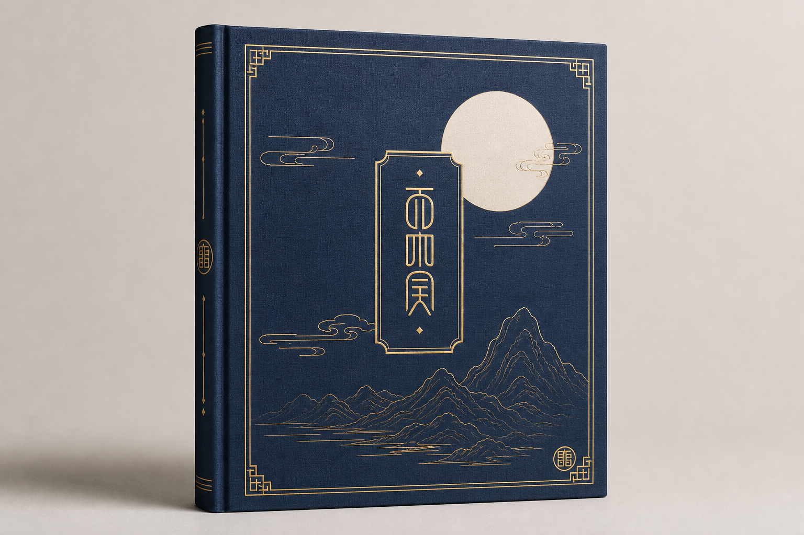
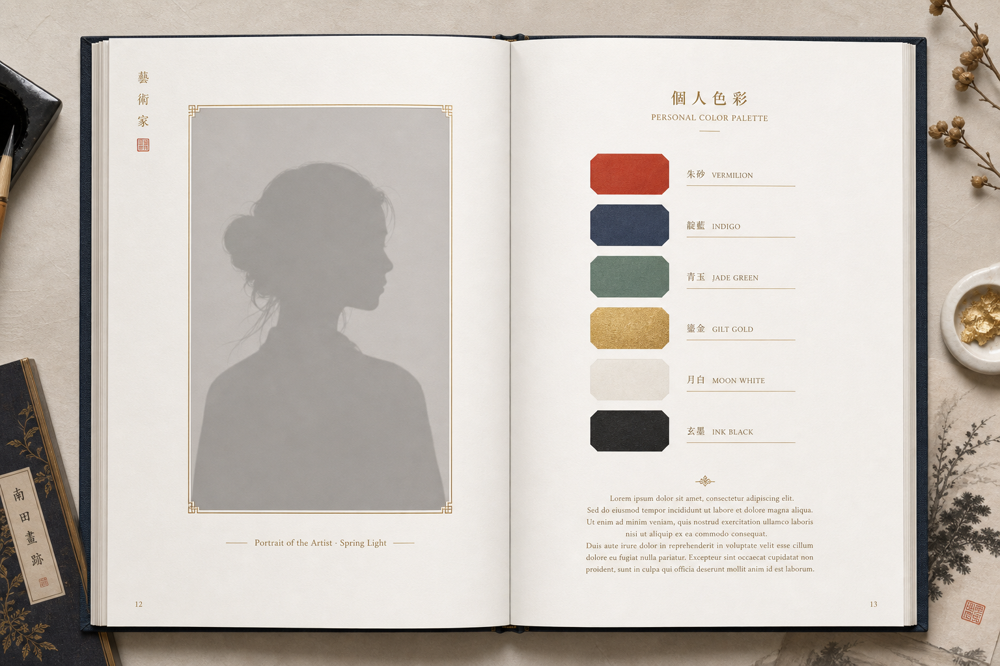
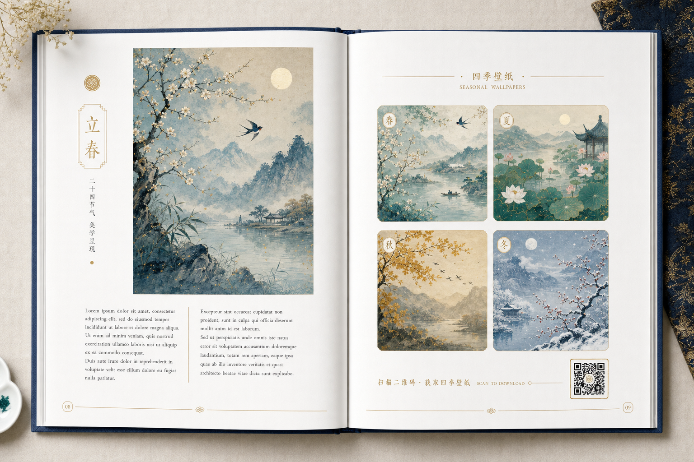

# 美学纪念册 · 交付内容定义（客服 / 印厂统一口径）

> 适用 SKU：高定订阅数字版（含于年度套餐）、`SKU-203` 美学纪念册·精装本（¥699）、`SKU-302` 实拍写真+命主画像+美学纪念册套装。
>
> 本页是**客服话术、印厂下单、内容排版**三方共用的口径基准。任何对外文案与成品，不得超出本页"包含/不包含"范围。
>
> **版式定稿**：下方「版式示意（终版）」为已确认的设计基准，印厂与排版以此为准。

---

## 〇、版式示意（终版 · 设计基准）

> 深蓝麻布 + 烫金、留白克制、月白艺术纸内文，统一国风编排（色卡见 §四 / 主计划书 19 色体系）。配图为版式占位示意，实际内容按客户专属作品替换。

**封面（精装 · 烫金）**

**内页跨页 1：命主画像页（左）+ 个人色彩页（右）**

**内页跨页 2：节气美学图文（左）+ 四季壁纸合辑（右，含下载二维码）**

> 版式要点：① 统一金线细框 + 大留白；② 每页页脚页码 + 章节印章；③ 壁纸页附扫码下载二维码；④ 正文用装饰性占位文字示意，成品替换为美学随笔（**不含命理推算**）。

---

## 一、一句话定位

「美学纪念册」是一本**以东方美学为线索、为客户个人定制的纪念读物**——把客户的命主画像、节气壁纸与节气/五行美学图文，汇编成一本可留存、可馈赠的精装（或数字）作品集。**它是美学纪念品，不是命理文书。**

---

## 二、包含什么（交付内容结构）

| 模块 | 内容 | 说明 |
|---|---|---|
| 封面 / 扉页 | 客户姓名 + 主题（如"四季·本命色"）+ 主理人 logo | 个性化定制页 |
| 命主画像页 | 1–3 张客户专属命主画像（实拍精修 / AI 无人脸背景合成） | 沿用实拍铁律 |
| 节气美学图文 | 二十四节气 / 五行主题的色彩、纹样、意象图文解读 | **美学叙事**，非运势 |
| 本命色卡页 | 客户专属用色组合（取自 19 色体系）+ 配色灵感 | 与壁纸/画像同源 |
| 节气壁纸合辑 | 客户套餐内壁纸的印刷版排布 | 数字版附下载二维码 |
| 美学随笔 | 围绕季节、色彩、传统纹样的轻文化短文 | 文化顾问把关准确性 |
| 收藏信息页 | 限量编号 / 制作日期 / 授权与脱敏说明 / AIGC 声明 | 末页固定 |

> 个性化来源：**客户姓名 + 所选主题 + 其专属视觉作品**。生辰仅用于决定**色彩坐标（美学用色）**，不展开任何命理推算文字。

---

## 三、不包含什么（红线）

- ❌ **不含八字 / 命理推算文字**：不写命格、运势、流年、吉凶、宜忌、姻缘、财运等断语。
- ❌ **不含算命 / 改运 / 转运 / 招财 / 辟邪 / 消灾**等任何功效或玄学宣称。
- ❌ **不含医疗 / 养生 / 疗效**类表述。
- ❌ 不替代任何专业命理、心理、医疗服务，不作预测性承诺。

> 客服遇到客户要求"加一段我的命理分析 / 运势"时，标准回复：
> "我们做的是**东方美学创作与纪念**，不算命、不预测。生辰只用作您专属配色的灵感坐标。如果您想了解命理，建议您咨询专业命理师哦~"

---

## 四、规格与版本

| 版本 | 形态 | 页数 | 装帧 / 材质 | 对应 SKU |
|---|---|---|---|---|
| 数字版 | PDF | 38–80 页 | 电子文件，含书签目录 | 含于高定订阅 |
| 精装本 | 实体书 | 38–80 页 | 精装锁线，内文艺术纸，烫金封面 + 礼盒 | `SKU-203` ¥699 |
| 收藏套装 | 实体书（套装件） | 38–80 页 | 精装本 + 木盒 + 限量编号 | `SKU-302` 套装 / 高定 3,999 档 |

- 出血 / 开本 / 色彩：印厂按标准画册规格（建议 210×285mm，CMYK，出血 3mm）。
- 个性化页与通用页分版：通用美学页可批量印，个性化页（封面/画像/色卡/信息页）按单合成。

---

## 五、生产流程

1. 取客户套餐内已交付的命主画像 / 壁纸 / 本命色卡（**实拍铁律**，人像 100% 实拍）。
2. 套用通用美学版式 → 合成个性化页（姓名 / 画像 / 色卡 / 编号）。
3. 文化顾问把关图文文化准确性（**仅美学，不作功效宣称**）。
4. 数字版导出 PDF（首页 + 末页加 AIGC 声明）；精装本送印 → 装订 → 质检。
5. 套装随 `SKU-302` 整套交付。

---

## 六、个人信息与授权

- 个性化页含客户姓名 / 画像 / 必要授权信息，按 `SKU-201` 同款授权流程取得书面授权。
- 对外展示样册一律**脱敏**（隐去真实姓名与可识别信息）。
- 源文件不外发；成品 PDF 保留主理人 logo + 续约二维码（防跳单，见主计划书 §医美机构风险）。

---

## 七、合规标注（固定）

- **AIGC**：含 AI 生成元素的图样，首页 + 末页声明"本作品视觉部分由 AI 辅助创作，色彩美学体系由主理人原创设计"。
- **广告法**：避免绝对化用语；纪念册描述只用"美学 / 纪念 / 收藏"维度。
- **封建迷信红线**：全册"美学化"表达，无任何运势 / 改运 / 吉凶内容（沿用主计划书 §11.4 / §11.5 / §11.2）。
