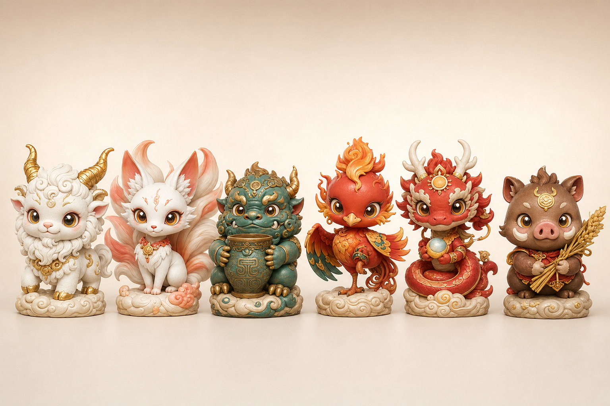
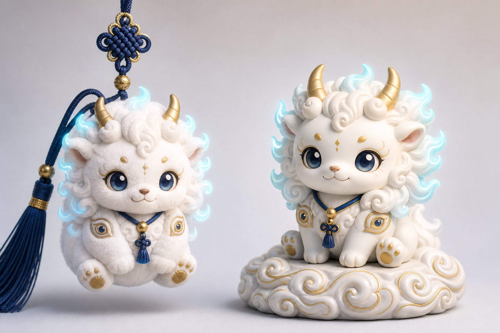
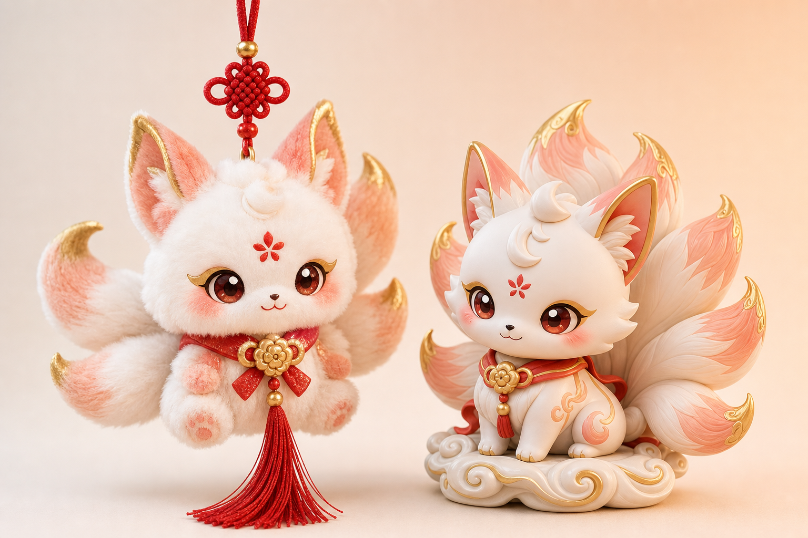
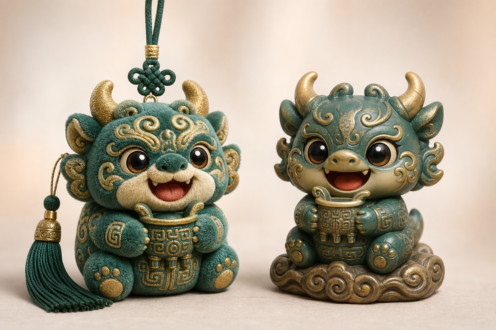
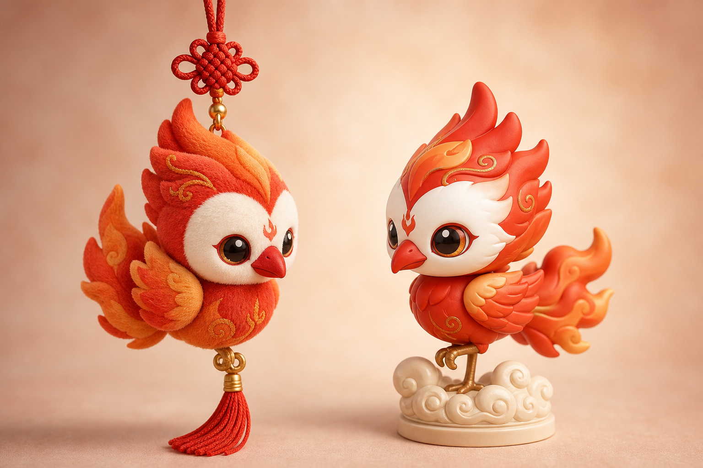
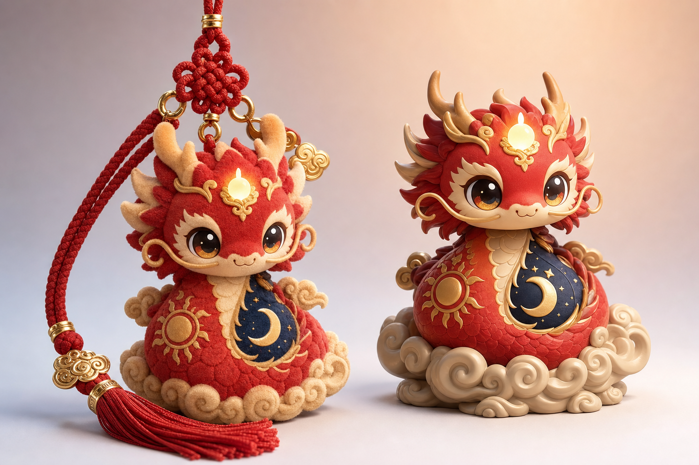
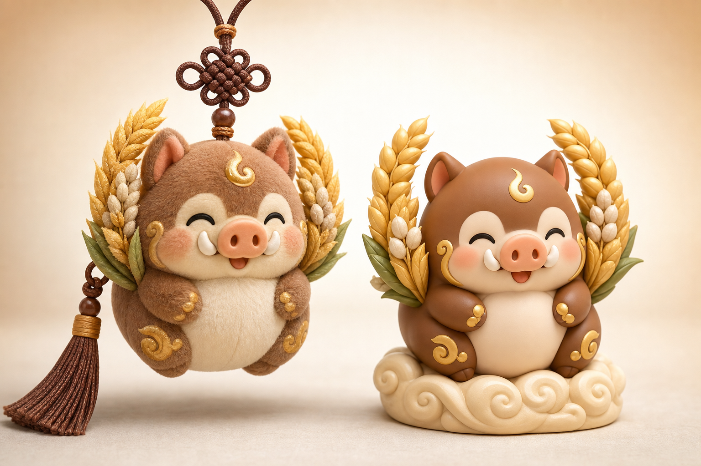

# 「山海有灵」山海经神兽 · 国风潮玩产品线

> 隶属《商业计划书 v1.6》§十七文创产品线。本系列为 6 神兽套系，形态含**毛绒小挂件**、**桌面摆件**，可延展盲盒/钥匙扣/冰箱贴。
>
> 配套 AI 提示词见同目录 `00-ai-prompts.md`；示意图见 `images/`。
>
> 合规：所有图样**含 AI 生成**（详情页与吊牌须标注）；文案**无功效宣称**（不写招财/辟邪/改运/护身/保平安）；仅作山海经文化与美学表达。

## 系列主图

---

## 一、六神兽一览

| 编号 | 神兽 | 人设关键词 | 主配色 | 形态 |
|---|---|---|---|---|
| SH-01 | 白泽 | 知物 · 温和小老师 | 月白+鎏金+黛蓝 | 挂件/摆件 |
| SH-02 | 九尾狐 | 优雅 · 灵动 | 月白暮粉+红金 | 挂件/摆件 |
| SH-03 | 饕餮 | 憨吃 · 反差萌 | 青铜绿+鎏金 | 挂件/摆件 |
| SH-04 | 毕方 | 火羽 · 独脚神鸟 | 朱红橙+月白 | 挂件/摆件 |
| SH-05 | 烛龙 | 昼夜 · 长条萌龙 | 朱红+鎏金+黛蓝 | 挂件/摆件 |
| SH-06 | 当康 | 丰岁 · 吉祥猪（带货款） | 暖棕+鎏金 | 挂件/摆件 |

---

## 二、各神兽展示

### SH-01 白泽 Báizé

- 文案：山海有灵·白泽，温润的「知物」瑞兽，金角云鬃，陪你案头读书。
- 形态：左·毛绒挂件（中国结挂绳）/ 右·搪胶摆件（祥云底座）。

### SH-02 九尾狐 Jiǔwěihú

- 文案：九尾灵狐，蓬尾点金，额心花钿，灵动优雅。

### SH-03 饕餮 Tāotiè

- 文案：青铜纹·馋馋饕餮，抱着小铜鼎憨吃笑，反差萌担当。

### SH-04 毕方 Bìfāng

- 文案：独脚火羽·毕方，火苗尾羽，白面红喙，灵巧立姿。

### SH-05 烛龙 Zhúlóng

- 文案：昼夜之龙·烛龙，额顶光珠，身绕日月祥云，圆萌长条龙。

### SH-06 当康 Dāngkāng

- 文案：丰岁·当康，胖嘟嘟衔麦穗，圆钝小牙，笑眼迎丰收（仅作美好寓意表达）。

---

## 三、SKU 与定价（接 §十七三档矩阵）

| SKU | 品类 | 形态 | 建议价 | 档位 |
|---|---|---|---|---|
| SH-PLUSH-S | 毛绒小挂件（单只） | 8–10cm 毛绒+中国结挂绳 | ¥39–59 | 易耗/引流 |
| SH-PLUSH-BLIND | 毛绒盲盒（6 款随机+隐藏） | 单只盲盒 | ¥59/只，整端 ¥708 | 易耗/复购 |
| SH-FIG-STD | 桌面摆件（搪胶/树脂） | 8–12cm + 祥云底座 | ¥129–199 | 中价值 |
| SH-FIG-GK | 收藏级手办（限量编号） | 15cm+ 精涂装 | ¥1,999–3,999 | 高端/收藏 |
| SH-SET6 | 六神兽全套礼盒 | 摆件×6 + 收藏卡 | ¥899–1,299 | 中高/送礼 |
| SH-DERIV | 衍生（钥匙扣/冰箱贴/徽章） | 配件 | ¥19–49 | 易耗 |

> 与 §十七人群覆盖呼应：学生/年轻人吃挂件与盲盒；白领与送礼吃摆件与套盒；收藏与 B 端定制吃限量手办。

---

## 四、量产与合规要点

1. **打样**：选定终稿 → 毛绒厂（绒料+绣花+挂绳）与手办厂（3D 建模+开模/树脂小批量）分别打样校色。
2. **玩具安全**：毛绒类按玩具安全标准执行（小零件、填充物、缝合牢度、阻燃、标签年龄提示）；面向儿童须符合强制要求（如 3C）。明确「装饰/收藏用途」或标注适用年龄。
3. **标签**：材质、执行标准、厂名厂址、警示语、**含 AI 生成**标识。
4. **知识产权**：山海经古籍属公有领域，但**本套造型为原创设计**，建议做版权登记 + 外观留痕；不得抄袭在售潮玩的具体角色。
5. **文案红线**：统一只讲「文化/美学/趣味/寓意」，**严禁**功效宣称与封建迷信话术。
6. **预售制**：盲盒与摆件先预售收单再小批量投产，降库存（接 §十七 M4+ 节奏）。

---

> 说明：本页示意图均由 **AI 生成**，仅作设计方向与电商视觉参考；量产以打样实物校色为准。
